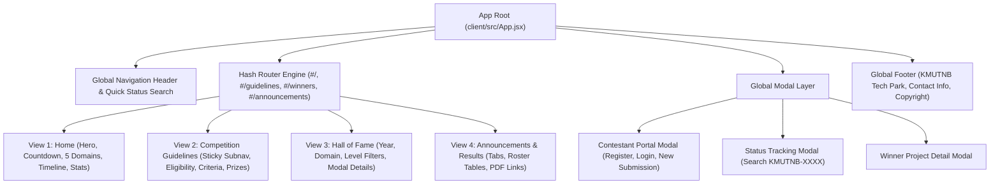

# Frontend Architecture & UI/UX Design Specification
**KMUTNB Innovation Awards 2026 Interactive Web Platform**

- **Date:** 2026-08-20
- **Status:** Approved
- **Target Documentation Artifact:** `docs/frontend-guide.html`
- **Application Core:** React 19, Vite, Tailwind CSS, Lucide React, Canvas Confetti

---

## 1. Overview & Objectives

The purpose of this specification is to define the full design system, view architecture, state flows, component hierarchy, and API communication contracts for the KMUTNB Innovation Awards 2026 frontend client. This will be published as an interactive standalone HTML document (`docs/frontend-guide.html`) complementary to the backend guide (`docs/backend-guide.html`).

---

## 2. Design System & Tokens

### 2.1 Color Palette
- **Deep Navy Background:** `#030712` (Base Canvas), `#0B132B` (Card Panel), `#1C2541` (Surface Raised)
- **Primary Cyber Cyan:** `#00F0FF` / `#06B6D4` (Hero Accents, Glowing Borders, CTA Buttons)
- **Royal Gold / Amber:** `#F59E0B` / `#FBBF24` (Royal Trophy, Badges, Highlights)
- **Emerald Green:** `#10B981` (Verified Badges, Submission Success)
- **Rose / Crimson:** `#F43F5E` / `#E11D48` (Medical Device Domain, Deadlines, Errors)

### 2.2 Typography Stack
- **Display Headings:** Inter (`system-ui`, `-apple-system`, `sans-serif`) with bold tracking
- **Body & Thai Text:** Anuphan (`sans-serif`) for optimal Thai legibility
- **Codes & Tracking Numbers:** JetBrains Mono (`monospace`) for tracking codes (`KMUTNB-YYYY-XXXX`)

### 2.3 Glassmorphism & UI Accents
- Background blur (`backdrop-blur-md`), 1px translucent borders (`rgba(6, 182, 212, 0.2)`), subtle radial gradient glows.

---

## 3. View & Component Hierarchy

---

## 4. State Management & Lifecycle Engines

### 4.1 URL Hash Routing Engine
- `#/` ➔ `home`
- `#/guidelines` ➔ `guidelines` (Supports `#eligibility`, `#domains`, `#prizes`, `#standards`, `#criteria`)
- `#/winners` ➔ `winners`
- `#/announcements` ➔ `announcements`

### 4.2 Real-Time Countdown Engine
- Calculates remaining time to deadline (15 November 2026, 23:59:59).
- Ticks every 1000ms, updates `days`, `hours`, `minutes`, `seconds`.

### 4.3 Modal Focus & Accessibility (a11y) Engine
- Traps keyboard `Tab` within active modal.
- Listens for `Escape` to close modal safely.
- Sets `aria-modal="true"` and appropriate ARIA labels.

---

## 5. API Handshake & Data Synchronization

| Frontend Feature | HTTP Method | API Endpoint | Data Payload & Purpose |
| :--- | :---: | :--- | :--- |
| **Initial Hall of Fame** | `GET` | `/api/winners` | Fetches historical awarded submissions with fallback to `FALLBACK_WINNERS` |
| **Announcements Hub** | `GET` | `/api/announcements` | Fetches official news and finalist rosters with fallback to `ANNOUNCEMENTS` |
| **User Registration** | `POST` | `/api/auth/register` | Sends name, email, phone, institution, level; stores JWT token in `localStorage` |
| **User Login** | `POST` | `/api/auth/login` | Authenticates user; stores JWT token in `localStorage` |
| **Submit Innovation** | `POST` | `/api/submissions` | Submits draft or final proposal with `coverImage`, video, title, members |
| **Track Status** | `GET` | `/api/submissions/status/:code` | Retrieves evaluation status, feedback, and team info |

---

## 6. Structure of `docs/frontend-guide.html`

The interactive HTML document will contain:
1. **Interactive Navigation Header:** Quick links between Frontend and Backend guides.
2. **Interactive Table of Contents (Sticky Sidebar):** Smooth scroll to sections.
3. **Mermaid Diagrams:** Component Hierarchy, User Submission Journey, and State Flow.
4. **Live Design Tokens & Palette Visualizer:** Interactive color swatches and typography scale.
5. **Screen-by-Screen Breakdown:** Visual mockups and component specifications for all 4 views and 3 modals.
6. **Code Examples & Integration Reference:** Copyable React code snippets and Tailwind styling patterns.
